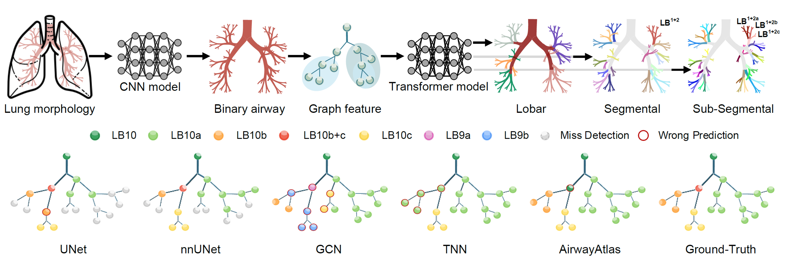
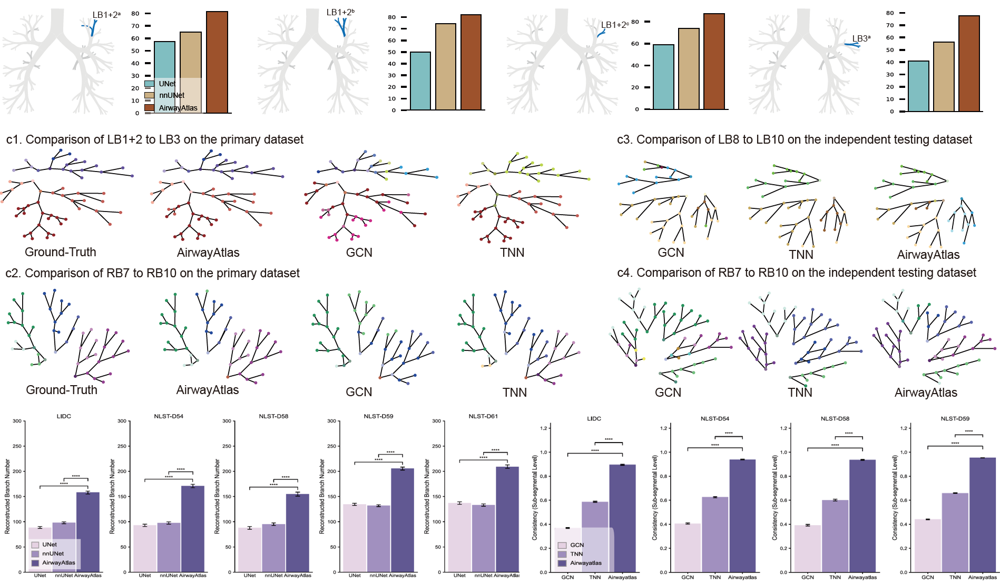
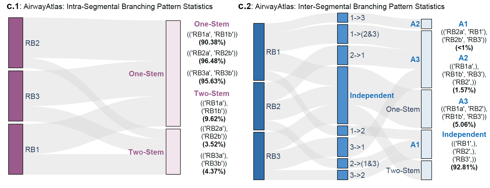
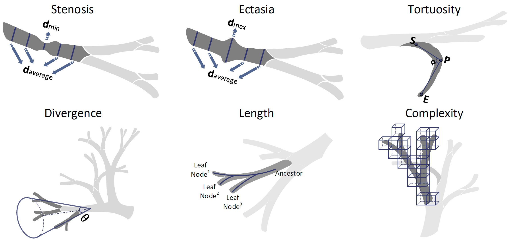

# AirwayNet

[](https://www.python.org/)
[](https://pytorch.org/)


`AirwayNet` is a robust, end-to-end deep learning pipeline enabling fully automatic and comprehensive airway anatomical labeling at lobar, segmental, and subsegmental resolutions. To facilitate precise clinical interpretation, we further propose an anatomical signature, quantifying critical morphological airway features—including stenosis, ectasia, tortuosity, divergence, length, and complexity. Additionally, AirwayNet supports efficient automated branching pattern analysis, significantly enhancing bronchoscopic navigation planning and procedural safety.

- [System Requirements](#system-requirements)
- [Installation Guide](#installation-guide)
- [Instructions for use and Demo](#instructions-for-use-and-demo)


# System Requirements
## Hardware requirements
AirwayNet was deployed and rigorously validated on a Linux workstation operating on Ubuntu 20.04. The hardware configuration includes a 12th Gen Intel® Core™ i9-12900KF CPU, 64 GB system memory, and an NVIDIA RTX 3090 GPU with 24 GB of VRAM.

## Software requirements
### OS Requirements
+ Linux: Ubuntu 20.04

### Python Dependencies
`AirwayNet` mainly depends on the Python scientific stack.

```
torch
pycuda
monai
numpy
SimpleITK
... ...
```

The full packages with specific version is included in `requirements.txt`

# Installation Guide
## Install from Github and with Anaconda
```
git clone https://github.com/EndoluminalSurgicalVision-IMR/AirMorph
cd AirMorph
```

Create the virtual environment with [Anaconda](https://www.anaconda.com/)
```
conda create -n airwayatlas python=3.10
conda activate airwayatlas
```

Install PyTorch based on your system configuration. For example:
```
pip install torch==2.5.1 torchvision==0.20.1 torchaudio==2.5.1 --index-url https://download.pytorch.org/whl/cu124
```

Then, install the remaining dependencies:
```
pip install -r requirements.txt
```

# Instructions for use and Demo
## Quick Start
We provide a dedicated pipeline wrapper in `airwayatlas_pipeline.py`, which utilizes the `sample_data` directory as the default input folder. For a quick start, simply execute the following command:

```
python airwayatlas_pipeline.py
```

This will run the pipeline, enabling users to quickly test and explore the functionality of AirwayNet.

## Step by Step Instruction
For comprehensive guidance on utilizing the software and analyzing the output, please refer to the detailed instructions provided in [Detailed_Instruction.md](Instruction_for_use\README.md).


# Gallery of Results
### AirwayNet: Automated Technical Pipeline
<div align=center></div>

### AirwayNet: Unified and Fine-grained Evaluation
<div align=center></div>

### AirwayNet: Efficient Branching Pattern Analysis
<div align=center></div>

### AirwayNet: Anatomical Signatures with Clinical Relevance
<div align=center></div>


<!-- > By the Team of Institute of Medical Robotics, Shanghai Jiao Tong University, Shanghai, China

<div align=center></div>


## Introduction
>> In this work, we introduce AirwayNet, a robust, end-to-end deep learning pipeline enabling fully automatic and comprehensive airway anatomical labeling at lobar, segmental, and subsegmental resolutions. To facilitate precise clinical interpretation, we further propose an anatomical signature, quantifying critical morphological airway features—including stenosis, ectasia, tortuosity, divergence, length, and complexity. Additionally, AirwayNet supports efficient automated branching pattern analysis, significantly enhancing bronchoscopic navigation planning and procedural safety.


## Usage
<div align=center></div>

### Binary Airway Modeling
Please refer to ```segmentator/airway_segmentator.py```.

### Airway Anatomical Modeling
Please refer to ```classifier/airway_classifier.py```.


Optionally, you can use the script for a quick start:

```
python airwayatlas_pipeline.py
```

### Airway Signature

<div align=center></div>

The morphological airway signatures can be found in ```features/airway_morph_features.py```.

Optionally, you can use the script for a quick start:

```
python airwaysign_pipeline.py
```

### Airway BranchingPattern

<div align=center></div>

Please refer to ```branchingpattern/airwaybranchpattern_pipeline.py```.


### Pretraind Model
The pretrained model could be accessed by this [link](https://drive.google.com/drive/folders/1T6VwUnHSkWzL7ghkImbWTqk6SGB-pan-?usp=sharing)

### Sample Data
The sample data could be accessed by this [link](https://drive.google.com/drive/folders/1CvkkL_EP1QcgvKiNIt7I_Yypij1ibflq?usp=sharing)

### Full Paper
More details and results of AirwayNet can be accessed by this [link](https://arxiv.org/abs/2412.11039)

## Citation
If you find this repository or our paper useful, please consider citing our paper:

```bibTex
@article{zhang2024digitalized,
  title={AirMorph: Topology-Preserving Deep Learning for Pulmonary Airway Analysis},
  author={Zhang, Minghui and Li, Chenyu and Zhang, Hanxiao and Liu, Yaoyu and Gu, Yun},
  journal={arXiv preprint arXiv:2412.11039},
  year={2024}
}
``` -->
